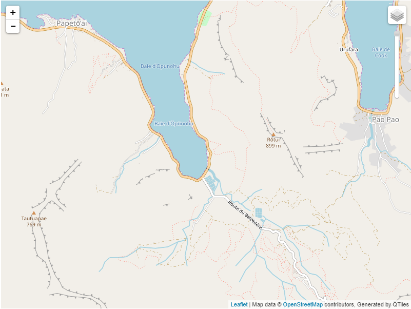

**QTiles layer for Mo'orea**

I have created QTiles displayed through a leaflet tileLayer of the island of Mo'orea, just west of Tahiti in French Polynesia. The center of the map is located at -17.5372, -149.8333, at a scale of 11, with a range in zoom levels from 7 to 15. The tiles were created in QGIS using their QTiles plugin and Tile Server.

